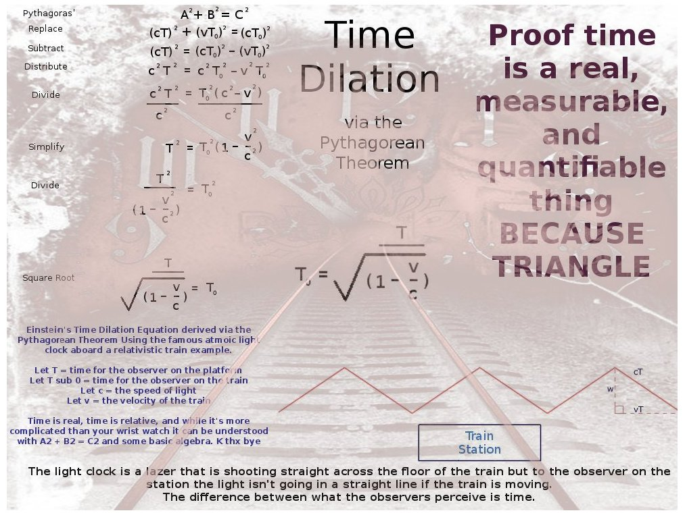

relativity-playground
=====================
- [8分鐘讀懂狹義相對論！時間變慢、長度變短、質量變重、E=mc²一次性全搞明白 | 雅桑了嗎 - YouTube](https://www.youtube.com/watch?v=wspDAnUrHTA)
- [愛因斯坦 狹義相對論 Special Relativity | 揭開神秘的面紗【不準國語：粵】#002 - YouTube](https://www.youtube.com/watch?v=eFv6FKWk2ps)
- [Time dilation - Wikipedia](https://en.wikipedia.org/wiki/Time_dilation)
- [Visualizing Time Dilation - YouTube](https://www.youtube.com/watch?v=5qQheJn-FHc)
- [Time Dilation formula derivation (Special Relativity) - YouTube](https://www.youtube.com/watch?v=1wmuGV2GIIM)
- [Intuitive Special Relativity - The Lorentz Transformation — Steemit](https://steemit.com/physics/@procrastilearner/intuitive-special-relativity-the-lorentz-transformation)
- [The concept of Time Dilation is pretty easy to understand, here’s how | by Bibek Panthi | Medium](https://panthibibek.medium.com/the-concept-of-time-dilation-is-pretty-easy-to-understand-heres-how-28de3263a0fa)

  - 1/2 vt means half the triangle, so we can do pythagorean theorem
  - t' is dilated time

- [Time Dilation via the Pythagorean Theorem proof time is real BECAUSE TRIANGLE! - Imgur](https://imgur.com/time-dilation-via-pythagorean-theorem-proof-time-is-real-because-triangle-y6ThJO0)
### Notes
- the `event`: photon travel from earth to moon
- the `observer`: A moving spaceship looking at the event
- the `distance` from from earth to moon: `L`
- the `distance` from from earth to moon observed by the `observer`: `D`
- speed = distance / time
- time = distance / speed
- time * speed = distance

### TLDR
- when `observer` see the `event`, `D`
- Velocity Time Dilation (Special Relativity)
- Gravitational Time Dilation (General Relativity)
